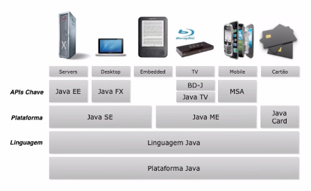
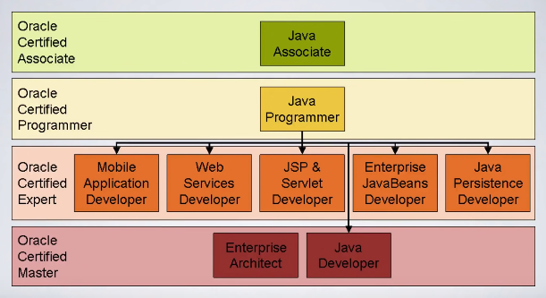
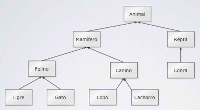

# Curso de Java Básico

```java
Por: Loiane Groner
Site: https://loiane.training/
```
## Aula 01 - Introdução e Dicas

### O que é a tecnologia Java?

- Simples
- Orientada a Objetos
- Distribuída
- Multithreaded
- Dinâmica
- Arquitetura neutra
- Portável
- Ótima Performance
- Robusta
- Segura

O Java é **WORA (Write Once Run Anywhere)**, ou seja, execute uma vez e rode em qualquer lugar. Isso é possível por causa da JVM (Java Virtual Machine).

### Plataforma e Ambiente Java

A plataforma Java é composta por:

- Java Virtual Machine (JVM)
- Java Application Programming Interface (API)

API é um conjunto de bibliotecas. Uma biblioteca é composta por um conjunto de códigos que permite fazer alguma coisa.

Existe uma plataforma Java para cada sistema operacional: Linux, MacOS e Windows.

O pai do Java é o James Goslin.

A Sun Microsystems foi a empresa responsável pela criação do Java. Posteriormente a Oracle comprou a Sun e se tornou a dona do Java.

Applets, hoje depreciados, foram responsáveis pela popularização do Java. Eles permitiam rodar o Java no navegador.

### O que se pode fazer com a tecnologia Java?



O Java é uma linguagem compilada e interpretada.

### Certificações



## Aula 05 - Primeiro Programa em Java

```java
class OlaMundo {
    public static void main(String[] args) {
        System.out.println("Olá, Mundo!");
    }
}
```
### Entendendo o código

`class` é a declaração da classe. O Java é orientado a objetos. Então, tudo no Java é objeto. Objeto é uma intância de uma classe.

`OlaMundo` é o nome da classe.

`public static void main(String[] args) {...}` é o método. As classes no Java têm métodos, que nada mais são do que funções. Nessa função são passados argumentos: array de strings. Esse é o ponto de entrada num programa Java. Isso não muda. O trecho `public statis` são modificadores de acesso do método. O `void` é o tipo de retorno do método. Aqui, o método não retorna nada. `main` é o nome do método. O Java é *case sensitive*. `String[] args` são parâmetros/argumentos do método.

`System.out.println("Olá, Mundo!")` é o comando que faz o *output* na tela.

E cada bloco está entre parênteses `{}`. São os delimitadores do bloco. Classes e métodos são blocos.

## Aula 07 - Entendendo os erros

### Tipos de erros

- Erros de sintaxe
- Erros de semâmntica
- Erros em tempo de execução

## Aula 09 - Introdução à Orientação a Objetos

### Vantagens da OO

- Reuso de código
- Reflete o mundo real
- Facilita a manutenção de código

### Conceitos

#### Classes

Classe é a descrição de um grupo de objetos. A classe contém:

- Nome da classe
- Conjunto de atributos (descrição)
- Conjunto de métodos (comportamento)

#### Objetos

É a instância ou modelo derivado de uma classe e que representa qualquer coisa, real ou abstrata, do mundo real. O objeto irá ser manipulado ou armazenado pelo sistema.

#### Herança

Herança permite a reutilização da estrutura e do comportamento de uma classe.



#### Polimorfismo

Habilidade de variáveis terem "mais de um tipo".

Considerando a figura anterior, o animal (classe-mãe) tem o comportamento de emitir som. Dependendo do tipo do animal (classe-filha) o som vai ser diferente. Ex.: o gato mia, o cachorro late, a vaca berra, a cobra sibila, o lobo ruiva.

#### Java: pacotes

- Forma de organizar as classes e bibliotecas (mas não só isso)
- Convenção: domínio + projeto + pasta. Exemplo: com.loiane.cursojava.aula09

## Aula 10 - Introdução a variáveis

### O que são variáveis

Variável é uma área de memória associada a um nome, que pode armazenar valores de um determinado tipo.

Exemplo: armazenar a idade de uma pessoa.

### Como declarar variáveis

É simples. Primeiro declara o tipo e depois o nome:

```java
<tipo> <nome davariável>;
```

Se quiser inicializar a variável:

```java
<tipo> <nome davariável> = <valor>;
```

### Convenção de nomeclatura

Antes de nomear uma variável é importante saber primeiro o que não se pode usar:

| abstract | continue | for | new | switch |
| assert | default | goto | package | synchronized |
| boolean | do | if | private | this |
| break | double | implements | protected | throw |
| byte | else | import | public | throws |
| case | enum | instanceof | return | transient |
| catch | extends | int | short | try |
| char | final | interface | static | void |
| class | finally | long | strictfp | volatile |
| const | float | native | super | while |

Convenção são regras seguidas por desenvolvedores. Além das regras, também têm as boas práticas. Assim, temos:

- A primeira letra da variável pode ser: `a-zA-Z_&`
- Da segunda letra em diante: `a-zA-Z_&0-9`
- E camelCase

> Apesar de poder usar o `&`, não se constuma usá-lo. Costuma-se usar letra minúscula ao nomear uma variável, ou seja, o camelCase. Ex.: `nomeDaPessoa`. E não há limite para o número de caracteres numa variável.

### Tipos primitivos

- `int`: números inteiros positivos e negativos. Ex.: 3, 456, -12
- `float` e `double`: Pontos flutuantes (números com vírgulas/pontos). Ex.: 5,2 e 5.2.
- `char`: caracteres. Ex.: a, B.
- `boolean`: valores verdadeiro (true) e falso (false).

## Aula 11 - Variáveis: tipos primitivos


## Aula 12 - Lendo dados do teclado usando a classe Scanner


